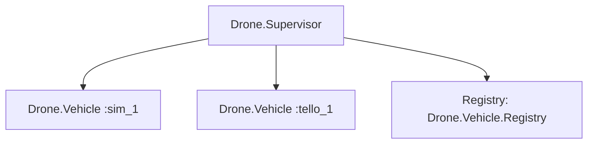

# v0.1.0 Design Plan

## Milestone: Simulator + Tello Foundation

### Goal

Deliver the first usable BEAM-native drone control library with a working simulator adapter and Tello UDP adapter, safety pipeline, telemetry, and complete documentation.

---

## Module Inventory

| Module                    | Responsibility                                      |
|---------------------------|-----------------------------------------------------|
| `Drone`                   | Public API entry point                              |
| `Drone.Vehicle`           | Supervised GenServer per drone                      |
| `Drone.Adapter`           | Behaviour definition for drone adapters             |
| `Drone.Adapters.Sim`      | Simulator adapter (in-process state machine)        |
| `Drone.Adapters.Tello`    | Tello UDP adapter                                   |
| `Drone.Command`           | Command struct and encoding                         |
| `Drone.Safety`            | Safety validation (pure module)                     |
| `Drone.Safety.Policy`     | Safety policy struct and defaults                   |
| `Drone.Telemetry`         | Telemetry event helpers                             |
| `Drone.Mission`           | Mission DSL for scripting command sequences          |
| `Drone.Error`             | Error types and helpers                             |

---

## Architecture

```mermaid
graph TD
    User[User Code] --> Drone
    Drone --> Vehicle[Drone.Vehicle GenServer]
    Vehicle --> Safety[Drone.Safety.check/3]
    Safety -->|approved| Adapter[Drone.Adapter behaviour]
    Safety -->|rejected| ErrorResult[{:error, :safety, reason}]
    Adapter --> Sim[Drone.Adapters.Sim]
    Adapter --> Tello[Drone.Adapters.Tello]
    Vehicle --> Telemetry[:telemetry events]
    Vehicle --> State[Vehicle State]
```

### Supervision Tree



- `Drone.Supervisor` is a `DynamicSupervisor`
- Each `Drone.Vehicle` is started dynamically via `Drone.connect/2`
- A `Registry` provides named access to vehicles
- If a vehicle crashes, the supervisor restarts it

---

## Public API

```elixir
# Connect to a drone (starts a supervised process)
{:ok, drone} = Drone.connect(:sim, name: :good_advice)
{:ok, drone} = Drone.connect(:tello, name: :tello_1, drone_ip: {192, 168, 10, 1})

# Enter SDK mode (Tello only; sim is automatically in SDK mode)
:ok = Drone.connect_sdk(drone)

# Flight commands
:ok = Drone.takeoff(drone)
:ok = Drone.hover(drone, seconds: 5)
:ok = Drone.move(drone, :up, 40)
:ok = Drone.move(drone, :forward, 50)
:ok = Drone.rotate(drone, :cw, 90)
:ok = Drone.land(drone)

# Emergency (bypasses all safety checks)
:ok = Drone.emergency(drone)

# Queries
{:ok, battery} = Drone.query(drone, :battery)
{:ok, height} = Drone.query(drone, :height)
{:ok, speed} = Drone.query(drone, :speed)

# Telemetry
{:ok, telemetry} = Drone.telemetry(drone)

# Disconnect
:ok = Drone.disconnect(drone)
```

---

## Drone.Vehicle GenServer

### State

```elixir
%{
  name: atom(),
  adapter_module: module(),
  adapter_state: term(),
  safety_policy: Drone.Safety.Policy.t(),
  vehicle_state: %{
    x: integer(),
    y: integer(),
    z: integer(),
    yaw: integer(),
    flying: boolean(),
    battery: integer(),
    speed: integer(),
    mode: :idle | :sdk_mode | :flying | :emergency,
    last_command: Drone.Command.t() | nil,
    command_history: [Drone.Command.t()]
  },
  socket: port() | nil  # Only for Tello adapter
}
```

### Key Callbacks

```elixir
# Connect
def handle_call({:connect, adapter, opts}, _from, state)

# Send command (via safety pipeline)
def handle_call({:command, %Drone.Command{} = cmd}, _from, state)

# Query
def handle_call({:query, query_type}, _from, state)

# Emergency (bypasses safety)
def handle_call(:emergency, _from, state)

# Telemetry snapshot
def handle_call(:telemetry, _from, state)

# Disconnect
def handle_call(:disconnect, _from, state)

# Receive UDP messages (Tello only)
def handle_info({:udp, socket, ip, port, data}, state)
```

---

## Command Pipeline

Every command flows through this pipeline:

```
1. User calls Drone.takeoff(drone) or similar
2. Drone module sends {:command, %Command{}} to Vehicle GenServer
3. Vehicle GenServer:
   a. Normalize command (ensure valid arguments)
   b. Validate command shape (correct types, ranges)
   c. Check safety policy (Drone.Safety.check/3)
   d. If rejected: emit [:drone, :safety, :reject], return error
   e. If approved: emit [:drone, :command, :start]
   f. Call adapter.command(state, command)
   g. Parse result
   h. Update vehicle state
   i. Emit [:drone, :command, :stop] or [:drone, :command, :error]
   j. Return result to caller
```

### Emergency Command

The emergency command bypasses steps (c) through (e):

```
1. User calls Drone.emergency(drone)
2. Drone module sends :emergency to Vehicle GenServer
3. Vehicle GenServer:
   a. Emit [:drone, :emergency]
   b. Call adapter.command(state, emergency_command)
   c. Set state to :emergency
   d. Return result
```

---

## Drone.Command Struct

```elixir
defmodule Drone.Command do
  @type direction :: :up | :down | :left | :right | :forward | :back
  @type rotation :: :cw | :ccw
  @type flip_direction :: :left | :right | :forward | :back
  @type query_type :: :battery | :height | :speed | :time | :wifi | :sdk_version | :serial_number

  @type t :: %__MODULE__{
    type: atom(),
    args: keyword(),
    raw: String.t() | nil
  }

  defstruct [:type, :args, :raw]
end
```

Command types:

| Type         | Args                         | Tello Encoding      |
|--------------|------------------------------|---------------------|
| `:sdk_mode`  | `[]`                         | `command`            |
| `:takeoff`   | `[]`                         | `takeoff`            |
| `:land`      | `[]`                         | `land`               |
| `:emergency` | `[]`                         | `emergency`           |
| `:move`      | `[direction: direction, distance: integer()]` | `up 40` / `forward 50` etc. |
| `:rotate`    | `[direction: rotation, degrees: integer()]` | `cw 90` / `ccw 180` |
| `:flip`      | `[direction: flip_direction]` | `flip l` / `flip r` etc. |
| `:hover`     | `[seconds: integer()]`       | N/A (implemented as `stop` + delay) |
| `:speed`     | `[speed: integer()]`         | `speed 50`           |
| `:query`     | `[type: query_type]`         | `battery?` / `height?` etc. |
| `:stop`      | `[]`                         | `stop`               |

---

## Project Structure

```
lib/
  drone.ex                        # Public API
  drone/
    vehicle.ex                    # GenServer for each drone
    adapter.ex                    # Adapter behaviour
    adapters/
      sim.ex                      # Simulator adapter
      sim/
        state.ex                  # Simulator state struct
      tello.ex                    # Tello UDP adapter
      tello/
        connection.ex             # UDP connection handling
        encoder.ex                # Command encoding
        parser.ex                 # Response parsing
    command.ex                    # Command struct
    safety.ex                     # Safety validation
    safety/
      policy.ex                  # Safety policy struct
    telemetry.ex                  # Telemetry event helpers
    mission.ex                    # Mission DSL
    error.ex                      # Error types

test/
  test_helper.exs
  drone_test.exs                  # Public API doctests
  drone/
    vehicle_test.exs              # Vehicle GenServer tests
    adapters/
      sim_test.exs                # Simulator adapter tests
      tello_test.exs              # Tello adapter tests
      tello/
        encoder_test.exs          # Command encoding tests
        parser_test.exs           # Response parsing tests
        fake_server.ex            # Fake UDP server for testing
    safety_test.exs               # Safety validation tests
    command_test.exs              # Command struct tests
    telemetry_test.exs             # Telemetry event tests
    mission_test.exs              # Mission DSL tests

config/
  config.exs                      # Default config
  dev.exs                         # Dev overrides
  test.exs                        # Test overrides
```

---

## Mix Project Configuration

```elixir
defp deps do
  [
    {:telemetry, "~> 1.0"}       # For :telemetry events
  ]
end
```

Minimal dependencies. `:telemetry` is the only external dependency. No JSON, no HTTP, no cloud deps.

---

## Testing Strategy

### Unit Tests

- **Command encoding**: Verify each command type produces the correct Tello string
- **Response parsing**: Verify each response type is parsed correctly
- **Safety validation**: Verify each safety rule accepts/rejects correctly
- **Simulator state transitions**: Verify the state machine

### Integration Tests

- **Vehicle GenServer**: Test the full command pipeline through a Vehicle process
- **Sim adapter**: Test complete missions using the simulator
- **Fake UDP server**: Test Tello adapter with a fake server

### Doctests

- `Drone` module: Examples in module docs
- `Drone.Command`: Encoding examples
- `Drone.Safety`: Validation examples

### Coverage

- Target: 70%+
- All safety logic must have 100% coverage
- All command parsing must have 100% coverage
- Adapter logic tested via simulator

---

## Implementation Order

1. **Drone.Command** -- struct and encoding, no dependencies
2. **Drone.Error** -- error types, no dependencies
3. **Drone.Adapter** -- behaviour definition, no dependencies
4. **Drone.Safety.Policy** -- policy struct, no dependencies
5. **Drone.Safety** -- validation logic, depends on Command and Policy
6. **Drone.Telemetry** -- event helpers, no dependencies
7. **Drone.Adapters.Sim** -- simulator, depends on Adapter, Command
8. **Drone.Vehicle** -- GenServer, depends on all above
9. **Drone.Adapters.Tello** -- UDP adapter, depends on Adapter, Command
10. **Drone.Mission** -- mission DSL, depends on Command
11. **Drone** -- public API, depends on Vehicle
12. **Tests for each module**

---

## Deliverables Checklist

- [ ] All modules implemented
- [ ] All tests passing
- [ ] 70%+ code coverage
- [ ] `mix format --check-formatted` passes
- [ ] `mix credo --strict` passes
- [ ] README.md with safety warning
- [ ] docs/getting_started.md
- [ ] docs/safety.md
- [ ] docs/simulator.md
- [ ] docs/tello.md
- [ ] docs/architecture.md
- [ ] docs/adapter_authoring.md
- [ ] docs/article_notes/v0_1_0.md
- [ ] docs/article_notes/building_ex_drone_v0_1_0.md
- [ ] Changelog entry